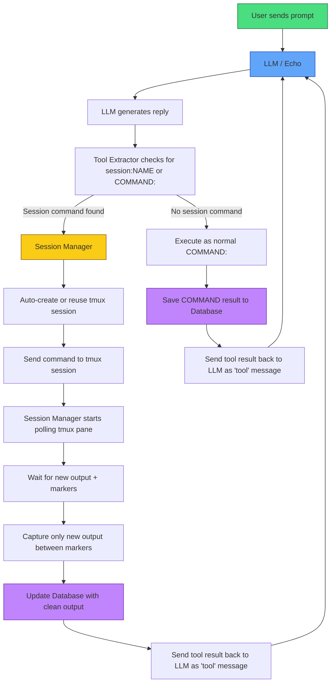

## Feedback Welcome
This project is still evolving. If you clone it, try it, or have ideas on how to improve it, **please** leave feedback or suggestions. Even small thoughts help a lot.

# Echo Tool System
This is the active development version of the Echo project — a lightweight, local LLM agent tool system written in Rust.
It is a continuation of the earlier [Echo tmux agentv3](https://github.com/charlesericwilson-portfolio/Echo_tmux_agentv3) and adds support for proxy-style tool calls, output summarization, and database logging.
Key idea: If your model can already tell you what commands to type and doesn't use a jinja template, it can use tools through this framework. No special fine-tuning is required.

The raw text methods (COMMAND: and SESSION:NAME) are ready to use out of the box.
JSON tool support is also available, though defining tools requires some setup.
A basic system prompt is included to teach the model the tool format, but you can replace it with your own.

Current version: Rust v5 (previous Python proxy version was v4)
The goal of this project is to keep the framework flexible so that the model’s capabilities are the main limitation — not artificial restrictions in the code.

### Quick Start

## Supported Backends

Echo works with **any server or API that speaks the OpenAI Chat Completions format**. You are **not** locked into llama.cpp.

### Local Servers (Recommended)
| Backend            | Notes                              | Recommendation      |
|--------------------|------------------------------------|---------------------|
| **llama.cpp**      | Use `--api` flag                   | Best overall        |
| **vLLM**           | High performance                   | Great for speed     |
| **Ollama**         | Built-in OpenAI compatibility      | Easiest to start    |
| **LM Studio**      | Has built-in OpenAI server         | Very beginner friendly |
| **TabbyAPI**       | Excellent with exllama/exllamav2   | Strong choice       |
| **Aphrodite**      | Good performance                   | Solid alternative   |
| **SGLang**         | Modern inference engine            | Good performance    |

### Cloud APIs
- **OpenAI**
- **Groq**
- **Together.ai**
- **Fireworks.ai**
- **DeepInfra**
- **OpenRouter**
- **Mistral** (OpenAI compatible mode)
- Most other OpenAI-compatible providers

> **Note:** Anthropic, Google Gemini, and raw Hugging Face endpoints are **not** supported at this time. In the process of adding a selector to pick between protocols.


 1. Make sure your [llama.cpp](https://github.com/ggml-org/llama.cpp) servers are running
```bash
    - git clone https://github.com/ggml-org/llama.cpp
    - cd llama.cpp
    - cmake -B build
    - cmake --build build --config Release -j$(nproc)
```
    - Main model: port 8080
    - Summarizer (small model): port 8082
 2. Install dependencies
```bash
    - sudo apt install tmux
    - sudo apt install cargo
    - sudo apt install rustup
```
 3. **Build and run the Rust version**
```bash
  cd [build directory]
  cargo build --release
  ./target/release/echo_rust_wrapper
  ```
 4. Edit the config.toml file with endpoints, deny commands, and system prompt paths.

## Current Status (May 2026)

- **Stable**: `COMMAND:` raw text tool execution
- **Functional**: Persistent `SESSION:NAME` tool execution via tmux with smart output capture
- **New (In Progress)**: JSON tool calling support (first working tool: `get_current_datetime`)
- Refactored to use config.toml to set endpoints and set your system prompts in text files for the main model and the summarizer model without recompiling.
- Context auto-summarization 
- SQLite database logging for all tool calls and summaries
- Safety deny-list for dangerous commands
- ShareGPT-style JSONL logging for training data

The agent can fluidly switch between raw text commands, persistent tmux sessions, and structured JSON tool calls depending on what the model decides to use or you can simply instruct the model to use one or more of your choosing. 

## Features

- **Hybrid Tool Calling**: Supports both simple `COMMAND:` / `SESSION:NAME` syntax and modern JSON function calling
- **Persistent Sessions**: Full tmux integration with named sessions and clean output capture
- **Flexible Architecture**: Designed so users can add their own tools easily
- **Local-First**: Works with local models (llama.cpp, Ollama, etc.)
- **Extensible**: Planning full TOML config support for endpoints, system prompts, and tool definitions

## Roadmap

- Complete JSON tool calling system
- TOML config file for endpoints, system prompt, and tool definitions (no recompilation needed)
- More built-in tools (web search, document generation, database queries, etc.)
- Cleaner terminal UI
- Better multi-model support (easy switching between local and cloud models)
- 
### What it does
- Supports **hybrid raw-text tool calling** and Json:
  - `COMMAND: <command>` for simple one-shot shell commands
  - `SESSION:NAME <command>` for persistent tmux sessions (ideal for msfconsole, long-running shells, etc.)
  - `JSON_TOOL: <Open AI tool format>`
- Automatic tmux session creation/reuse
- Marker-based clean output capture (only returns new command output, not full session history)
- Safety deny list (blocks dangerous commands before execution)
- JSONL logging in ShareGPT format (already capturing training examples of when/why to use SESSION vs COMMAND)
- Fast blocking HTTP client talking to your local llama.cpp servers
- Sqlite database support for tool logging.
- Auto summarization of context at 50K tokens.
- Interrupt generation using ctl+\ end session using ctl+c.


Persistent sessions with complex tools (full msfconsole workflows) are still being tuned. Context management and summarizer behavior continue to be refined. Database integration for all tool calls for auditing complete. Now supports Json function calling.


Next steps: Building datasets and adding database support. Finetuning the base model check it out [Echo_training_project](https://github.com/charlesericwilson-portfolio/Echo_training_project)
