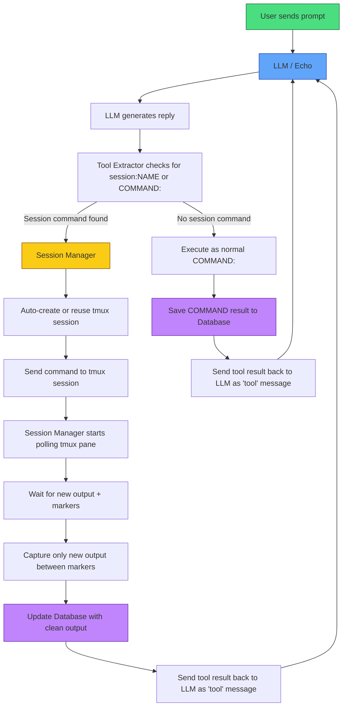

## Feedback Welcome
This project is still evolving. If you clone it, try it, or have ideas on how to improve it, **please** leave feedback or suggestions. Even small thoughts help a lot.

# Echo_Tool_System
Continuation of [Echo tmux agentv3](https://github.com/charlesericwilson-portfolio/Echo_tmux_agentv3) and adds proxy tool calls, output summarization, and database support. If your model can tell you what to type it can use any CLI tool installed with this framework. Easy to build just follow the instructions at the end and fill in the config.toml and your set. The JSON support requires some knowledge to define your tools but the logic is there. The raw text methods are ready to go. I have included a basic system prompt that instructs the model the tool format but you can make it your own.

**Current Version:** Rust v5 (Python proxy was v4)

This is the active development version of **Echo project** — a lightweight, local LLM agent tool system written in Rust.
The goal is to keep the **framework flexible** so the model’s capabilities are the main limitation — not artificial restrictions in the code.

## Current Status (May 2026)

- **Stable**: `COMMAND:` raw text tool execution
- **Functional**: Persistent `SESSION:NAME` tool execution via tmux with smart output capture
- **New (In Progress)**: JSON tool calling support (first working tool: `get_current_datetime`)
- Refactored to use config.toml to set endpoints and set your system prompts in text files for the main model and the summarizer model without recompiling.
- Context auto-summarization 
- SQLite database logging for all tool calls and summaries
- Safety deny-list for dangerous commands
- ShareGPT-style JSONL logging for training data

The agent can fluidly switch between raw text commands, persistent tmux sessions, and structured JSON tool calls depending on what the model decides to use or you can simply instruct the model to use one or more of your choosing. 

## Features

- **Hybrid Tool Calling**: Supports both simple `COMMAND:` / `SESSION:NAME` syntax and modern JSON function calling
- **Persistent Sessions**: Full tmux integration with named sessions and clean output capture
- **Flexible Architecture**: Designed so users can add their own tools easily
- **Local-First**: Works with local models (llama.cpp, Ollama, etc.)
- **Extensible**: Planning full TOML config support for endpoints, system prompts, and tool definitions

## Roadmap

- Complete JSON tool calling system
- TOML config file for endpoints, system prompt, and tool definitions (no recompilation needed)
- More built-in tools (web search, document generation, database queries, etc.)
- Cleaner terminal UI
- Better multi-model support (easy switching between local and cloud models)
- 
### What it does
- Supports **hybrid raw-text tool calling** and Json:
  - `COMMAND: <command>` for simple one-shot shell commands
  - `SESSION:NAME <command>` for persistent tmux sessions (ideal for msfconsole, long-running shells, etc.)
  - `JSON_TOOL: <Open AI tool format>`
- Automatic tmux session creation/reuse
- Marker-based clean output capture (only returns new command output, not full session history)
- Safety deny list (blocks dangerous commands before execution)
- JSONL logging in ShareGPT format (already capturing training examples of when/why to use SESSION vs COMMAND)
- Fast blocking HTTP client talking to your local llama.cpp servers
- Sqlite database support for tool logging.
- Auto summarization of context at 50K tokens.
- Interrupt generation using ctl+\ end session using ctl+c.


Persistent sessions with complex tools (full msfconsole workflows) are still being tuned. Context management and summarizer behavior continue to be refined. Database integration for all tool calls for auditing complete. Now supports Json function calling.

### Quick Start

 1. Make sure your [llama.cpp](https://github.com/ggml-org/llama.cpp) servers are running
```bash
    - git clone https://github.com/ggml-org/llama.cpp
    - cd llama.cpp
    - cmake -B build
    - cmake --build build --config Release -j$(nproc)
```
    - Main model: port 8080
    - Summarizer (small model): port 8082
 2. Install dependencies
```bash
    - sudo apt install tmux
    - sudo apt install cargo
    - sudo apt install rustup
```
 3. **Build and run the Rust version**
```bash
  cd [build directory]
  cargo build --release
  ./target/release/echo_rust_wrapper
  ```
 4. Edit the config.toml file with endpoints, deny commands, and system prompt paths.

Next steps: Building datasets and adding database support. Finetuning the base model check it out [Echo_training_project](https://github.com/charlesericwilson-portfolio/Echo_training_project)
